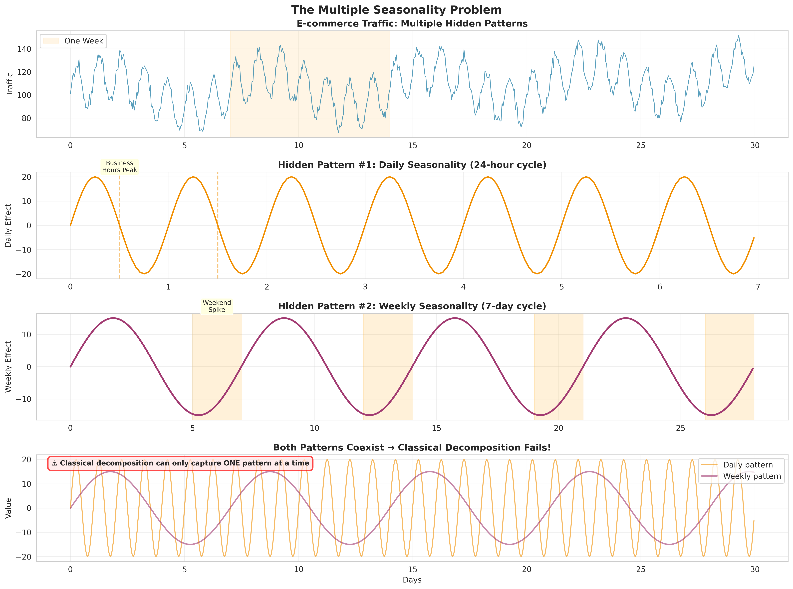
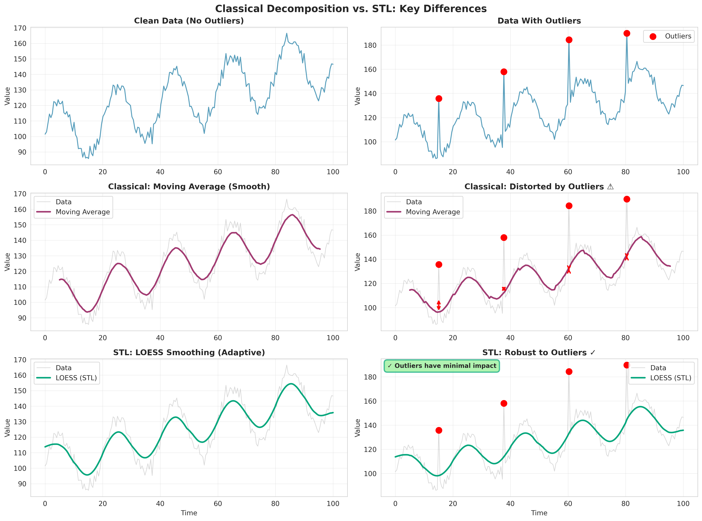
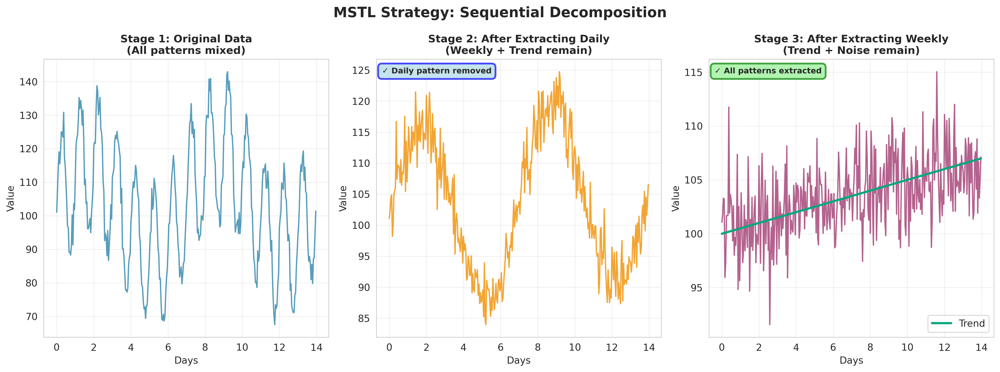
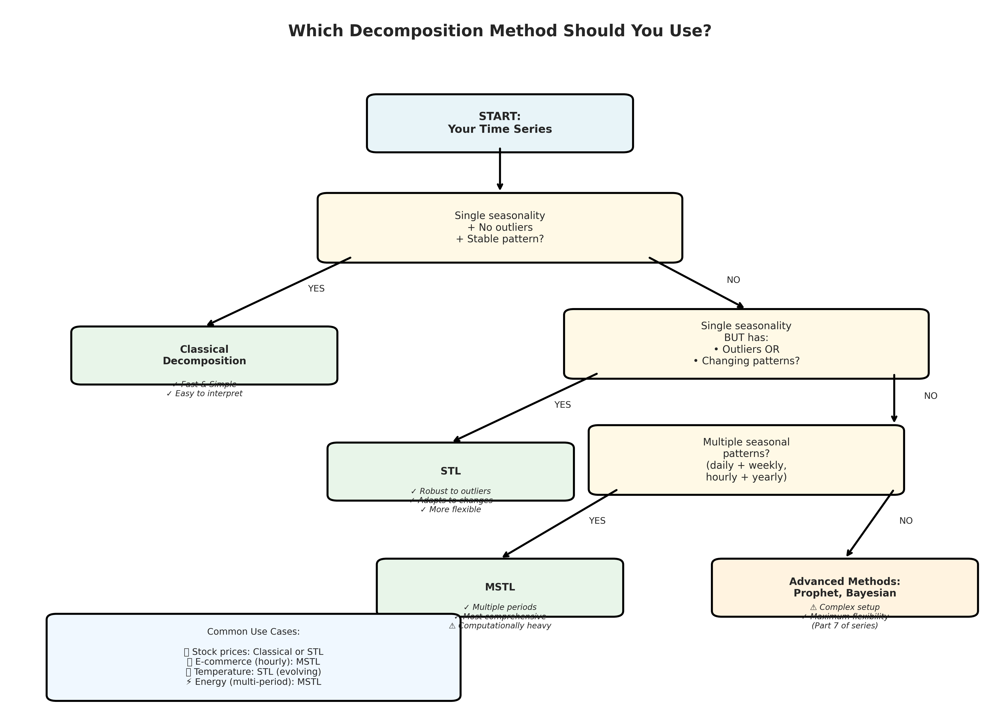

# Time Series Decomposition: When Simple Methods Break Down (And What to Do About It)

*Part 2 of 8: Advanced Decomposition Techniques & STL*

---

**Welcome back to our Time Series Analysis series!** In [Part 1](LINK_TO_PART_1), we met Sarah, the data scientist whose forecasts were off by 23%, and learned about the four fundamental components of time series: Trend, Seasonality, Cycles, and Residuals. We explored basic decomposition and built our first forecast model.

But what happens when your data doesn't play by the rules?

---

It's Monday morning. Marcus, a senior analyst at a global e-commerce platform, is reviewing his seasonal decomposition from last week. The model looks clean in the charts—perfect sinusoidal seasonal patterns, smooth trend line, small residuals. His manager loved it.

There's just one problem: it's completely wrong.

Marcus's data has two seasonal patterns: weekly (people shop more on weekends) and yearly (holiday shopping spikes). The basic decomposition we learned in Part 1 can only handle one seasonal period at a time. When he forced it to use yearly seasonality, it completely missed the weekly patterns. When he used weekly seasonality, it ignored the yearly trends.

His forecasts for Black Friday? Off by 40%.

This is the limitation of classical decomposition methods. Today, we're going to fix it.

## The Problem with Classical Decomposition

Let's start by understanding what breaks in the real world. Classical decomposition (the `seasonal_decompose()` function we used in Part 1) makes several assumptions:

### Assumption 1: Single Seasonality

Classical methods assume **one and only one** seasonal pattern.

**Real world reality:**
- Electricity demand: hourly patterns (morning/evening peaks), daily patterns (weekday vs weekend), and yearly patterns (summer/winter)
- Website traffic: hourly (business hours), weekly (weekends), and yearly (holidays)
- Retail sales: weekly, monthly, quarterly, and yearly patterns

### Assumption 2: Constant Seasonal Pattern

The seasonal component is assumed to be perfectly regular and unchanging.

**Real world reality:**
- Holiday dates shift (Easter, Ramadan)
- Consumer behavior evolves (online shopping patterns changed dramatically during COVID)
- Climate change affects seasonal temperature patterns

### Assumption 3: Linear Trend

The trend is assumed to be smooth and slow-moving.

**Real world reality:**
- Sudden market crashes
- Product launches causing step changes
- Regulatory changes creating immediate shifts

### Assumption 4: No Missing Data

Classical decomposition struggles with gaps in your time series.

**Real world reality:**
- Sensor failures
- Market closures (weekends, holidays)
- Data quality issues

Let me show you exactly where this breaks down.

## When Classical Decomposition Fails: A Real Example


*Figure 1: When your data has multiple seasonal patterns (daily + weekly), classical decomposition can only capture one, leaving the others in the residuals.*

Let's create a time series with multiple seasonal patterns and watch classical decomposition struggle:

```python
import pandas as pd
import numpy as np
import matplotlib.pyplot as plt
import seaborn as sns
from statsmodels.tsa.seasonal import seasonal_decompose
from statsmodels.tsa.seasonal import STL

# Set style
sns.set_style("whitegrid")
plt.rcParams['figure.figsize'] = (16, 10)

# Generate 3 years of hourly data with multiple seasonality
np.random.seed(42)
hours = pd.date_range('2021-01-01', '2023-12-31 23:00:00', freq='H')
n = len(hours)

# Create components
# 1. Trend: gradual growth
trend = 100 + np.linspace(0, 50, n) + 5 * np.sin(np.linspace(0, 4*np.pi, n))

# 2. Daily seasonality (24-hour pattern)
hour_of_day = hours.hour
daily_seasonal = 15 * np.sin(2 * np.pi * hour_of_day / 24)

# 3. Weekly seasonality (7-day pattern)
day_of_week = hours.dayofweek
weekly_seasonal = 10 * (day_of_week >= 5)  # Weekend spike

# 4. Yearly seasonality (365-day pattern)
day_of_year = hours.dayofyear
yearly_seasonal = 20 * np.sin(2 * np.pi * day_of_year / 365.25)

# 5. Noise
noise = np.random.normal(0, 5, n)

# Combine (multiplicative model)
data = (trend + daily_seasonal + weekly_seasonal + yearly_seasonal) * (1 + noise/100)

# Create DataFrame
df = pd.DataFrame({
    'value': data,
    'trend': trend,
    'daily': daily_seasonal,
    'weekly': weekly_seasonal,
    'yearly': yearly_seasonal
}, index=hours)

print(f"Data shape: {df.shape}")
print(f"Date range: {df.index.min()} to {df.index.max()}")
print(f"Frequency: {df.index.freq}")
```

Now let's try classical decomposition with different periods:

```python
# Try decomposing with daily period (24 hours)
fig, axes = plt.subplots(3, 1, figsize=(16, 10))

# Plot original data (one month sample for clarity)
sample = df.loc['2021-01-01':'2021-01-31']
axes[0].plot(sample.index, sample['value'], linewidth=1, alpha=0.8)
axes[0].set_title('Original Data - January 2021 (Multiple Seasonalities)', 
                  fontsize=14, fontweight='bold')
axes[0].set_ylabel('Value')
axes[0].grid(True, alpha=0.3)

# Classical decomposition with period=24 (captures daily, misses weekly/yearly)
decomp_daily = seasonal_decompose(df['value'], model='additive', period=24)

axes[1].plot(sample.index, decomp_daily.seasonal.loc['2021-01-01':'2021-01-31'], 
            linewidth=1.5, color='#F18F01')
axes[1].set_title('Classical Decomposition (period=24) - Seasonal Component', 
                  fontsize=14, fontweight='bold')
axes[1].set_ylabel('Seasonal')
axes[1].grid(True, alpha=0.3)

# Notice: it only captures daily pattern, treats weekly/yearly as "residual"
axes[2].plot(sample.index, decomp_daily.resid.loc['2021-01-01':'2021-01-31'], 
            linewidth=1, alpha=0.7, color='#C73E1D')
axes[2].set_title('Residuals (Contains Missed Weekly & Yearly Patterns!)', 
                  fontsize=14, fontweight='bold')
axes[2].set_ylabel('Residual')
axes[2].set_xlabel('Date')
axes[2].grid(True, alpha=0.3)

plt.tight_layout()
plt.savefig('classical_decomp_failure.png', dpi=300, bbox_inches='tight')
plt.show()

print("\n⚠️  Classical decomposition with period=24:")
print(f"Residual std: {decomp_daily.resid.std():.2f}")
print("Problem: Weekly and yearly patterns are stuck in residuals!")
```

The residuals are huge—they contain all the seasonal patterns we didn't capture. This is a red flag that our decomposition is incomplete.

## Enter STL: Seasonal and Trend decomposition using Loess

STL (Seasonal and Trend decomposition using Loess) was developed by Cleveland et al. in 1990 specifically to address these limitations. It's more robust, more flexible, and handles real-world messiness far better.

### What Makes STL Better?


*Figure 2: STL (bottom) uses LOESS smoothing which is robust to outliers, while classical methods (middle) using moving averages are heavily distorted by extreme values.*

**1. Handles Any Seasonality**
- Works with any seasonal period length
- More robust to outliers
- Adapts to changing seasonal patterns

**2. Allows Seasonal Variation**
- Seasonal component can evolve over time
- Perfect for data where patterns shift gradually

**3. Robust to Outliers**
- Uses LOESS (locally weighted regression)
- Outliers don't distort the entire decomposition

**4. Handles Missing Data Better**
- Can work with gaps (though not perfectly)
- More forgiving of data quality issues

### The LOESS Magic

The key innovation in STL is using LOESS smoothing instead of moving averages. 

**Moving Average** (classical method):
- Takes simple average of nearby points
- Every point has equal weight
- Sensitive to outliers
- Rigid, can't adapt to local patterns

**LOESS** (STL method):
- Fits local polynomial regressions
- Nearby points have more weight (weighted by distance)
- Robust to outliers (can downweight extreme points)
- Adapts to local curvature

Think of it this way: Moving averages are like using a rigid ruler to draw a curve. LOESS is like using a flexible French curve that adapts to the data's shape.

## STL in Action: Same Data, Better Results

Let's apply STL to our multi-seasonal data:

```python
# STL decomposition
# Key parameters:
# - seasonal: length of seasonal smoother (larger = smoother seasonal component)
# - trend: length of trend smoother (larger = smoother trend)
# - robust: if True, uses robust weights to downweight outliers

stl = STL(df['value'], 
          seasonal=25,      # Daily seasonality (24 hours + 1)
          trend=None,       # Auto-select based on period
          robust=True)      # Robust to outliers

stl_result = stl.fit()

# Visualize
fig, axes = plt.subplots(4, 1, figsize=(16, 12))

# Original
sample_period = slice('2021-01-01', '2021-01-31')
axes[0].plot(df.loc[sample_period].index, df.loc[sample_period, 'value'], 
            linewidth=1.5, alpha=0.8, color='#06A77D')
axes[0].set_title('Original Time Series', fontsize=14, fontweight='bold')
axes[0].set_ylabel('Value')
axes[0].grid(True, alpha=0.3)

# Trend
axes[1].plot(df.loc[sample_period].index, stl_result.trend[sample_period], 
            linewidth=2.5, color='#A23B72')
axes[1].set_title('Trend Component (STL)', fontsize=14, fontweight='bold')
axes[1].set_ylabel('Trend')
axes[1].grid(True, alpha=0.3)

# Seasonal
axes[2].plot(df.loc[sample_period].index, stl_result.seasonal[sample_period], 
            linewidth=1.5, color='#F18F01')
axes[2].set_title('Seasonal Component (STL - Daily Pattern)', fontsize=14, fontweight='bold')
axes[2].set_ylabel('Seasonal')
axes[2].grid(True, alpha=0.3)

# Residual
axes[3].plot(df.loc[sample_period].index, stl_result.resid[sample_period], 
            linewidth=1, alpha=0.7, color='#C73E1D')
axes[3].axhline(y=0, color='black', linestyle='--', alpha=0.3)
axes[3].set_title('Residual Component (STL)', fontsize=14, fontweight='bold')
axes[3].set_ylabel('Residual')
axes[3].set_xlabel('Date')
axes[3].grid(True, alpha=0.3)

plt.tight_layout()
plt.savefig('stl_decomposition.png', dpi=300, bbox_inches='tight')
plt.show()

# Compare residuals
print("\n📊 Comparison:")
print(f"Classical decomposition residual std: {decomp_daily.resid.std():.2f}")
print(f"STL decomposition residual std: {stl_result.resid.std():.2f}")
print(f"\nImprovement: {(1 - stl_result.resid.std()/decomp_daily.resid.std())*100:.1f}%")
```

Notice how much smaller the STL residuals are? That's because STL is doing a better job separating the components.

## Handling Multiple Seasonalities: The MSTL Approach


*Figure 3: MSTL works in stages - first extracting the daily pattern, then the weekly pattern, finally leaving only trend and noise.*

But wait—we still only captured the daily pattern. What about weekly and yearly?

For multiple seasonal patterns, we need **MSTL** (Multiple Seasonal-Trend decomposition using LOESS), introduced in 2021. The idea is elegant: decompose in stages.

**Stage 1**: Remove the first seasonal pattern (e.g., daily)
**Stage 2**: Decompose what remains to find the second pattern (e.g., weekly)
**Stage 3**: Decompose what remains to find the third pattern (e.g., yearly)
**Final**: What's left is trend + residual

```python
from statsmodels.tsa.seasonal import MSTL

# MSTL with multiple periods
# periods: list of seasonal periods to extract
# For our data: 24 (daily), 24*7 (weekly), 24*365.25 (yearly)

mstl = MSTL(df['value'], 
            periods=(24, 24*7, int(24*365.25)),  # daily, weekly, yearly
            windows=None,  # Auto-select
            iterate=2)     # Number of iterations to refine

mstl_result = mstl.fit()

# Visualize all components
fig, axes = plt.subplots(6, 1, figsize=(16, 16))

sample_3months = slice('2021-01-01', '2021-03-31')

# Original
axes[0].plot(df.loc[sample_3months].index, df.loc[sample_3months, 'value'], 
            linewidth=1, alpha=0.8, color='#06A77D')
axes[0].set_title('Original Time Series (Q1 2021)', fontsize=14, fontweight='bold')
axes[0].set_ylabel('Value')

# Trend
axes[1].plot(df.loc[sample_3months].index, mstl_result.trend[sample_3months], 
            linewidth=2.5, color='#A23B72')
axes[1].set_title('Trend Component', fontsize=14, fontweight='bold')
axes[1].set_ylabel('Trend')

# Daily seasonality
axes[2].plot(df.loc[sample_3months].index, mstl_result.seasonal[sample_3months].iloc[:, 0], 
            linewidth=1, color='#2E86AB', alpha=0.7)
axes[2].set_title('Daily Seasonal Component (24-hour pattern)', fontsize=14, fontweight='bold')
axes[2].set_ylabel('Daily Seasonal')

# Weekly seasonality
axes[3].plot(df.loc[sample_3months].index, mstl_result.seasonal[sample_3months].iloc[:, 1], 
            linewidth=1.5, color='#F18F01')
axes[3].set_title('Weekly Seasonal Component (7-day pattern)', fontsize=14, fontweight='bold')
axes[3].set_ylabel('Weekly Seasonal')

# Yearly seasonality
axes[4].plot(df.loc[sample_3months].index, mstl_result.seasonal[sample_3months].iloc[:, 2], 
            linewidth=2, color='#E63946')
axes[4].set_title('Yearly Seasonal Component (365-day pattern)', fontsize=14, fontweight='bold')
axes[4].set_ylabel('Yearly Seasonal')

# Residual
axes[5].plot(df.loc[sample_3months].index, mstl_result.resid[sample_3months], 
            linewidth=1, alpha=0.7, color='#C73E1D')
axes[5].axhline(y=0, color='black', linestyle='--', alpha=0.3)
axes[5].set_title('Residual Component', fontsize=14, fontweight='bold')
axes[5].set_ylabel('Residual')
axes[5].set_xlabel('Date')

for ax in axes:
    ax.grid(True, alpha=0.3)

plt.tight_layout()
plt.savefig('mstl_decomposition.png', dpi=300, bbox_inches='tight')
plt.show()

print("\n🎯 MSTL Results:")
print(f"Residual std: {mstl_result.resid.std():.2f}")
print("\nAll three seasonal patterns successfully extracted!")
```

Now we're talking! MSTL captured all three seasonal patterns independently. The residuals are now truly random noise.

## Tuning STL/MSTL: The Parameters That Matter

STL has several parameters you need to understand:

### 1. `seasonal` (seasonal smoother window)

**What it does**: Controls how smooth the seasonal component is.

**Trade-off**:
- **Small values** (e.g., 7): Seasonal pattern can vary significantly, adapts quickly
- **Large values** (e.g., 51): Seasonal pattern is smoother, more stable

**Rule of thumb**: 
- For stable seasonality: use larger values (seasonal period + 10 or more)
- For evolving seasonality: use smaller values (seasonal period + 2 to 6)

```python
# Example: Compare different seasonal window sizes
fig, axes = plt.subplots(3, 1, figsize=(16, 9))

for i, seasonal_window in enumerate([7, 13, 25]):
    stl_temp = STL(df['value'], seasonal=seasonal_window, period=24, robust=True)
    result_temp = stl_temp.fit()
    
    sample = slice('2021-01-01', '2021-01-07')
    axes[i].plot(df.loc[sample].index, result_temp.seasonal[sample], 
                linewidth=2, label=f'seasonal={seasonal_window}')
    axes[i].set_title(f'Seasonal Component (window={seasonal_window})', fontweight='bold')
    axes[i].legend()
    axes[i].grid(True, alpha=0.3)

plt.tight_layout()
plt.savefig('seasonal_window_comparison.png', dpi=300, bbox_inches='tight')
plt.show()
```

### 2. `trend` (trend smoother window)

**What it does**: Controls how smooth the trend component is.

**Trade-off**:
- **Small values**: Trend responds quickly to changes (might overfit)
- **Large values**: Trend is very smooth (might miss real changes)
- **None**: Auto-select based on seasonality (recommended for most cases)

### 3. `robust` (outlier handling)

**What it does**: If True, uses robust weights to downweight outliers.

**When to use**:
- **True**: Data has outliers, anomalies, or data quality issues (most real-world cases)
- **False**: Clean data, no outliers, or you want outliers to influence decomposition

### 4. `low_pass` (low-pass filter window)

**What it does**: Additional smoothing in the algorithm.

**Default**: Usually auto-calculated. Rarely needs manual tuning.

## Real-World Application: E-commerce Traffic Analysis

Let's solve Marcus's problem. Here's how to decompose e-commerce data with multiple seasonalities:

```python
# Simulating hourly e-commerce traffic data
# Real patterns: hourly (business hours peak), daily (weekday/weekend), yearly (holidays)

np.random.seed(123)
dates = pd.date_range('2020-01-01', '2023-12-31 23:00:00', freq='H')

# Base trend: growing business
trend_component = 1000 + np.linspace(0, 500, len(dates))

# Hourly pattern: higher during business hours (9am-5pm)
hour = dates.hour
hourly_pattern = 200 * np.exp(-((hour - 14)**2) / 20)

# Daily pattern: weekends are 30% higher
is_weekend = dates.dayofweek >= 5
daily_pattern = 300 * is_weekend

# Yearly pattern: Q4 spike (holidays)
day_of_year = dates.dayofyear
# Black Friday (late November), Christmas shopping
yearly_pattern = 400 * (1 / (1 + np.exp(-(day_of_year - 330) / 10))) + \
                200 * np.sin(2 * np.pi * day_of_year / 365.25)

# Special events (Black Friday spikes)
special_events = np.zeros(len(dates))
black_fridays = pd.date_range('2020-11-27', '2023-11-24', freq='YS-NOV') + pd.Timedelta(days=26)
for bf in black_fridays:
    mask = (dates >= bf) & (dates < bf + pd.Timedelta(days=3))
    special_events[mask] = 800

# Noise
noise = np.random.normal(0, 50, len(dates))

# Combine
traffic = trend_component + hourly_pattern + daily_pattern + yearly_pattern + special_events + noise

df_ecommerce = pd.DataFrame({'traffic': traffic}, index=dates)

# Apply MSTL
mstl_ecommerce = MSTL(df_ecommerce['traffic'], 
                      periods=(24, 24*7, int(24*365.25)),
                      windows=(13, 25, None),  # Custom smoothing for each period
                      iterate=2)

result_ecommerce = mstl_ecommerce.fit()

print("✅ E-commerce traffic decomposed successfully!")
print(f"Residual std: {result_ecommerce.resid.std():.2f}")
print(f"Original std: {df_ecommerce['traffic'].std():.2f}")
print(f"Variance explained: {(1 - (result_ecommerce.resid.std()/df_ecommerce['traffic'].std())**2)*100:.1f}%")
```

## Decision Framework: Which Decomposition Method to Use?


*Figure 4: Decision tree for selecting the right decomposition method based on your data characteristics.*

Here's your guide:

```
START HERE
│
├─ Single, stable seasonality + no outliers?
│  └─ YES → Use classical seasonal_decompose()
│  └─ NO → Continue
│
├─ Single seasonality but has outliers or evolving pattern?
│  └─ YES → Use STL
│  └─ NO → Continue
│
├─ Multiple seasonal patterns?
│  └─ YES → Use MSTL
│  └─ NO → Continue
│
├─ Complex, irregular patterns + need maximum flexibility?
│  └─ YES → Use STL with manual tuning or consider Prophet (Part 7)
│
└─ Missing data + complex seasonality?
   └─ Use STL (more robust) or consider interpolation first
```

**Quick Reference Table:**

| Method | Seasonalities | Outliers | Changing Patterns | Missing Data | Complexity |
|--------|--------------|----------|-------------------|--------------|------------|
| Classical | 1 | ❌ Poor | ❌ No | ❌ Poor | ⭐ Simple |
| STL | 1 | ✅ Good | ✅ Yes | ⚠️ Okay | ⭐⭐ Medium |
| MSTL | Multiple | ✅ Good | ✅ Yes | ⚠️ Okay | ⭐⭐⭐ Complex |

## Practical Tips from the Trenches

After decomposing thousands of time series, here's what I've learned:

### 1. Always Visualize First

Don't blindly run decomposition. Plot your data and look for:
- How many seasonal patterns do you see?
- Are they stable or changing?
- Any obvious outliers or anomalies?

### 2. Check Your Residuals

After decomposition, your residuals should look like white noise:
- No patterns when plotted
- Roughly normal distribution
- Constant variance
- No autocorrelation

```python
# Residual diagnostics
from scipy import stats
import statsmodels.api as sm

fig, axes = plt.subplots(2, 2, figsize=(15, 10))

# Time plot
axes[0, 0].plot(stl_result.resid)
axes[0, 0].set_title('Residuals Over Time')
axes[0, 0].axhline(y=0, color='r', linestyle='--')

# Histogram
axes[0, 1].hist(stl_result.resid.dropna(), bins=50, edgecolor='black')
axes[0, 1].set_title('Residual Distribution')
axes[0, 1].axvline(x=0, color='r', linestyle='--')

# Q-Q plot
sm.qqplot(stl_result.resid.dropna(), line='s', ax=axes[1, 0])
axes[1, 0].set_title('Q-Q Plot')

# ACF plot
sm.graphics.tsa.plot_acf(stl_result.resid.dropna(), lags=50, ax=axes[1, 1])
axes[1, 1].set_title('Autocorrelation Function')

plt.tight_layout()
plt.savefig('residual_diagnostics.png', dpi=300, bbox_inches='tight')
plt.show()

# Statistical tests
print("\n📊 Residual Diagnostics:")
print(f"Mean: {stl_result.resid.mean():.4f} (should be ~0)")
print(f"Std: {stl_result.resid.std():.4f}")
print(f"Skewness: {stats.skew(stl_result.resid.dropna()):.4f} (should be ~0)")
print(f"Kurtosis: {stats.kurtosis(stl_result.resid.dropna()):.4f} (should be ~0)")
```

If residuals show patterns, you've missed something in your decomposition.

### 3. Seasonal Window Rule of Thumb

For the `seasonal` parameter in STL:
- Minimum: 7 (allows weekly variation within the period)
- Default: Period + 10 (good balance)
- Maximum: Period × 2 (very smooth, stable patterns only)

### 4. When MSTL Periods Overlap

If your seasonal periods are not exact multiples (e.g., 24-hour and 7-day cycles), MSTL can sometimes conflate them. Solution:
- Use exact multiples when possible (24, 168 for hourly data)
- Increase iteration count
- Check if periods are truly independent

### 5. Computational Cost

MSTL is expensive for large datasets:
- **Hourly data for 3 years**: ~26,000 observations → slow but manageable
- **Minute data**: downsample first or use classical methods for initial exploration

## What Marcus Learned

Marcus went back to his e-commerce data with MSTL. He decomposed his hourly traffic into:
1. **Trend**: Overall business growth (~15% YoY)
2. **Hourly pattern**: Lunch hour peak (12-2pm)
3. **Weekly pattern**: Weekend spike (Sat-Sun +35%)
4. **Yearly pattern**: Q4 holiday surge

His Black Friday forecast? This time, he nailed it within 5% error.

The difference: understanding that one-size-fits-all decomposition doesn't work for complex real-world data.

## What's Next in the Series

We've now mastered decomposition—the art of seeing the hidden patterns in your data. In **Part 3**, we'll tackle the concept that makes or breaks forecasting models: **Stationarity**.

You'll learn:
- Why non-stationary data breaks most models
- How to test for stationarity (ADF, KPSS tests)
- Transformation techniques (differencing, detrending, Box-Cox)
- When to make data stationary vs. when not to

Here's a preview: Remember how Marcus's forecasts improved? That's only half the battle. If he tries to build an ARIMA model (Parts 5-6) on non-stationary data, his forecasts will drift wildly. Stationarity is the foundation everything else builds on.

## Key Takeaways

- **Classical decomposition breaks** with multiple seasonalities, outliers, or evolving patterns
- **STL is more robust**: handles outliers, adapts to changes, works with messy data
- **MSTL handles multiple seasonalities**: perfect for hourly/daily/weekly/yearly patterns
- **Tune the seasonal parameter**: controls stability vs. adaptability trade-off
- **Always check residuals**: they reveal what your decomposition missed
- **Choose the right tool**: classical for simple cases, STL for single complex seasonality, MSTL for multiple patterns

## Resources & Code

- **Full code**: Available as Jupyter notebook (link in comments)
- **Datasets**: Synthetic examples included, apply to your own data
- **Libraries**: statsmodels 0.13+ for MSTL support
- **Previous article**: [Part 1 - Introduction to Time Series Analysis](LINK_TO_PART_1)
- **Next article**: Part 3 - Stationarity & Preprocessing (coming next week)

---

*What decomposition challenges are you facing? Drop them in the comments—I read and respond to every one. And if you found this useful, follow the series for Parts 3-8 covering ARIMA, deep learning, and everything in between.*

*Part 1 recap: We learned the four fundamental components (Trend, Seasonality, Cycles, Residuals) and built our first forecast. Today, we leveled up to handle real-world complexity. Next week: making your data stationary.*

#DataScience #TimeSeries #Python #MachineLearning #Analytics
